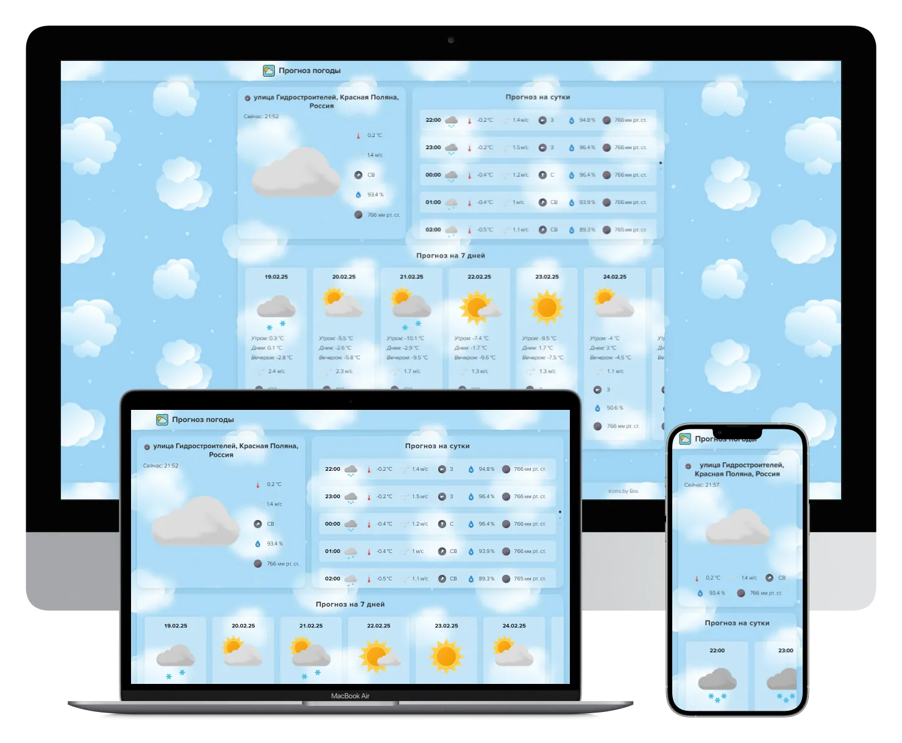

# Weather forecast

[🇬🇧 English](#english) | [🇷🇺 Русский](#русский)

---

## English

### Weather forecast

Project: https://weather-forecast.yuriyplotnikovv.ru/

Personal project in PHP and JS

A website with a weather forecast. It shows the current weather, the forecast for the day and the forecast for the week. The location is determined by ip or geolocation.

---

### About the project

#### Pages:

- Main

#### Functionality:

- Swiper is connected
- Integration with APIs: met.no (weather), openstreetmap.org (address), ipdata.co (coordinates by IP), timezonedb.com (time zone)
- English language (translations from variables), language detection based on browser preferences
- Cached data from JSON files

#### Not Implemented:

- Weather map

---

### License

This project is licensed under the [GNU Affero General Public License v3 (AGPLv3)](https://www.gnu.org/licenses/agpl-3.0.html).

---

### Contacts

Author: Yuriy Plotnikov  
Website: https://yuriyplotnikovv.ru  

---

## Русский

### Прогноз погоды

Проект: https://weather-forecast.yuriyplotnikovv.ru/

Личный проект на PHP и JS

Сайт с прогнозом погоды. Показывается текущая погода, прогноз на сутки и прогноз на неделю. Местоположение определяется по ip или по геолокации.

---

### О проекте

#### Страницы:

- Главная

#### Функциональность:

- Подключен Swiper
- Интеграция с Api: met.no (погода), openstreetmap.org (адрес), ipdata.co (координаты по ip), timezonedb.com (временной регион)
- Английский язык (переводы из переменных), определение языка на основе предпочтений в браузере
- Кешированные данные из JSON файлов

#### Не реализовано:

- Карта погоды

---

### Лицензия

Проект распространяется под лицензией [GNU Affero General Public License v3 (AGPLv3)](https://www.gnu.org/licenses/agpl-3.0.html).

---

### Контакты

Автор: Yuriy Plotnikov  
Сайт: https://yuriyplotnikovv.ru  
